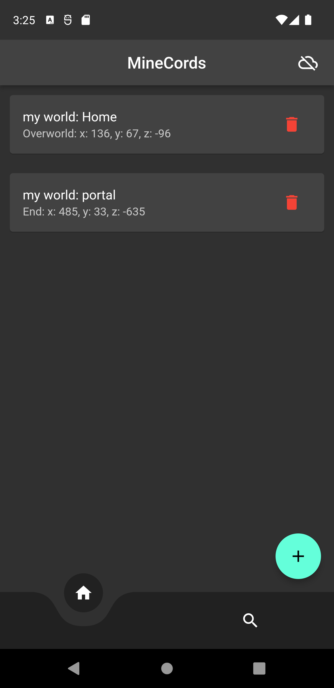

# minecords

simple app for storing minecraft coordinates

## preview

## install

download your version form [releases](https://github.com/LAITH343/minecords/releases)
or build from source code

### supported platform
| platform | Version |
| ---------| --------|
| Android  | 4.4.4+  |
| IOS      | 11+     |
| Linux    | x64     |
| Macos    | 10.14+  |
| Windows  | 10+     |

for more information visit [Supported deployment platforms
](https://docs.flutter.dev/reference/supported-platforms)

## Storage Capacity
The approximate number of coordinates that can be stored in different database storage sizes:

#### 1 Kilobyte (1 KB)
Approximately 5 coordinate can be stored in 1 KB of storage.

#### 100 Kilobytes (100 KB)
Approximately 560 coordinate can be stored in 100 KB of storage.

#### 1 Megabyte (1 MB)
Approximately 5,727 coordinate can be stored in 1 MB of storage.

#### 100 Megabytes (100 MB)
Approximately 572,732 coordinate can be stored in 100 MB of storage.

#### 1 Gigabyte (1 GB)
Approximately 5,862,505 coordinate can be stored in 1 GB of storage.

